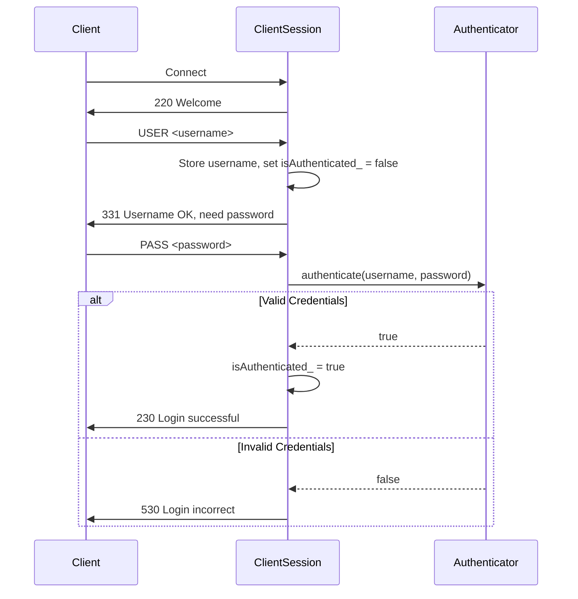

# FTP Server — Authentication Analysis

## Project Overview

This is a C++20 FTP server with socket-based networking, supporting commands: `USER`, `PASS`, `QUIT`, `NOOP`, `PWD`, `CWD`, `LIST`, `MKD`, `RMD`, `DELE`, and `PASV`. Authentication is file-based via [users.txt](file:///home/ayush/root/FTP_SERVER/users.txt) with `username:password` pairs.

---

## Authentication Flow

---

## Verdict: Functionally Correct ✅

The core authentication logic is **correct for an educational/hobby FTP server**. The `USER` → `PASS` handshake follows the FTP protocol (RFC 959), credential lookup works, and the `isAuthenticated_` guard is applied consistently across all protected commands.

However, there are several **bugs and security issues** worth calling out, ranging from a real correctness bug to hardening items.

---

## 🐛 Bug: Double-Close of `clientSocket_`

This is the one actual **correctness bug** in the codebase (not strictly auth, but it affects the session lifecycle):

| Location | What happens |
|---|---|
| [FTPServer.cpp:82](file:///home/ayush/root/FTP_SERVER/src/FTPServer.cpp#L82) | `::close(clientSocket)` after `session.start()` returns |
| [ClientSession.cpp:61-62](file:///home/ayush/root/FTP_SERVER/src/ClientSession.cpp#L61-L62) | `~ClientSession()` also calls `::close(clientSocket_)` |

The same file descriptor is closed **twice**. On Linux this is undefined behavior — if another thread/connection reuses that fd number between the two closes, you'll silently close the wrong socket. Fix: remove the `::close(clientSocket)` in `FTPServer.cpp:82` since the destructor already handles it.

---

## ⚠️ Security & Robustness Issues

### 1. Plaintext Passwords on Disk

[users.txt](file:///home/ayush/root/FTP_SERVER/users.txt) stores passwords in cleartext (`ayush:1234`, `admin:qwerty`, `guest:guest`). Anyone with read access to the file system gets all credentials.

> [!WARNING]
> For anything beyond a learning project, passwords should be hashed (e.g., bcrypt/scrypt) and the `authenticate()` method should hash the input before comparison.

### 2. No Brute-Force Protection

[handlePASS](file:///home/ayush/root/FTP_SERVER/src/ClientSession.cpp#L88-L106) has no rate-limiting, attempt counting, or lockout. A client can spam `USER`/`PASS` indefinitely.

### 3. Username Can Be Changed After Login

After a successful login, a client can send `USER newname` again. This sets `isAuthenticated_ = false` ([line 82](file:///home/ayush/root/FTP_SERVER/src/ClientSession.cpp#L82)) and changes the identity, which is fine protocol-wise (RFC 959 allows re-login), but could be surprising. Worth noting.

### 4. `QUIT` and `NOOP` Don't Require Auth

[handleQUIT](file:///home/ayush/root/FTP_SERVER/src/ClientSession.cpp#L107-L111) and [handleNOOP](file:///home/ayush/root/FTP_SERVER/src/ClientSession.cpp#L112-L116) skip the `isAuthenticated_` check. This is actually **correct per RFC 959** — `QUIT` and `NOOP` should work before login. ✅

### 5. `users.txt` Path Is Relative & Hardcoded

The path `"users.txt"` is [hardcoded in the constructor](file:///home/ayush/root/FTP_SERVER/src/ClientSession.cpp#L52). If the server is started from a different working directory, `loadUsers` will fail silently (it only prints to `stderr` and returns, leaving the `users` map empty — meaning **nobody can log in**, but the server keeps running).

### 6. No Password Over-The-Wire Encryption

FTP inherently sends `PASS` in cleartext over TCP. This is a known limitation of the FTP protocol itself (not a code bug). FTPS or SFTP would be needed for encrypted auth.

---

## Auth Guard Consistency Check

Every command that accesses the filesystem is properly guarded:

| Command | Auth check at top of handler? | Verdict |
|---------|------------------------------|---------|
| `USER` | N/A (part of login) | ✅ |
| `PASS` | N/A (part of login) | ✅ |
| `QUIT` | No check (correct per RFC) | ✅ |
| `NOOP` | No check (correct per RFC) | ✅ |
| `PWD` | ✅ [Line 120](file:///home/ayush/root/FTP_SERVER/src/ClientSession.cpp#L120) | ✅ |
| `CWD` | ✅ [Line 138](file:///home/ayush/root/FTP_SERVER/src/ClientSession.cpp#L138) | ✅ |
| `LIST` | ✅ [Line 202](file:///home/ayush/root/FTP_SERVER/src/ClientSession.cpp#L202) | ✅ |
| `MKD` | ✅ [Line 325](file:///home/ayush/root/FTP_SERVER/src/ClientSession.cpp#L325) | ✅ |
| `RMD` | ✅ [Line 272](file:///home/ayush/root/FTP_SERVER/src/ClientSession.cpp#L272) | ✅ |
| `DELE` | ✅ [Line 408](file:///home/ayush/root/FTP_SERVER/src/ClientSession.cpp#L408) | ✅ |
| `PASV` | ✅ [Line 461](file:///home/ayush/root/FTP_SERVER/src/ClientSession.cpp#L461) | ✅ |

**All filesystem-modifying commands are properly gated.** No unprotected command bypasses exist.

---

## Authenticator Code Quality

| Aspect | Status | Notes |
|--------|--------|-------|
| File parsing ([loadUsers](file:///home/ayush/root/FTP_SERVER/src/Authenticator.cpp#L11-L36)) | ✅ Correct | Handles empty lines, splits on `:` properly |
| Credential lookup ([authenticate](file:///home/ayush/root/FTP_SERVER/src/Authenticator.cpp#L37-L43)) | ✅ Correct | Uses `unordered_map::find`, constant-time lookup |
| File-open failure handling | ⚠️ Silent | Logs to `stderr` but continues with empty user map |
| Thread safety | ⚠️ Not thread-safe | If the server were multithreaded, concurrent reads of `users` during a reload would race. Current single-threaded model is fine. |

---

## Summary

> [!IMPORTANT]
> The authentication logic is **functionally correct**. The `USER`/`PASS` handshake, credential validation, and `isAuthenticated_` guards are all properly implemented and consistent across every command handler.

The one real bug is the **double-close of `clientSocket_`** in [FTPServer.cpp:82](file:///home/ayush/root/FTP_SERVER/src/FTPServer.cpp#L82). The security items (plaintext passwords, no rate limiting, hardcoded path) are expected for a learning project but would need addressing for production use.
